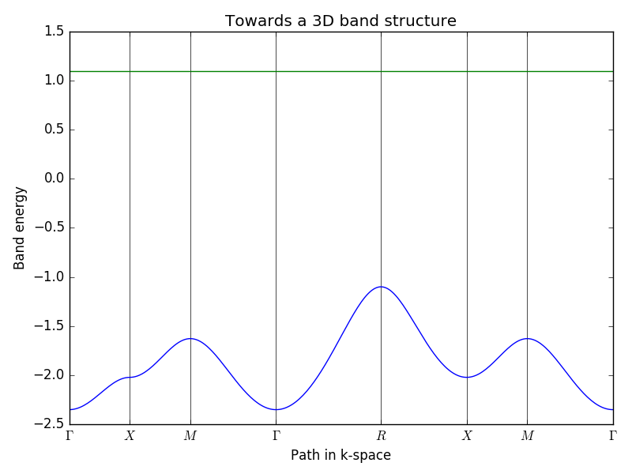

# MAPI-TB

(Work in Progress) Tight binding model for MAPI based on the excellent [PythTB](http://physics.rutgers.edu/pythtb/) module [1].

The motivation is to build a tight-binding model of the electronic structure to
allow large scale calculations in disordered assemblies.

[1] http://physics.rutgers.edu/pythtb/
